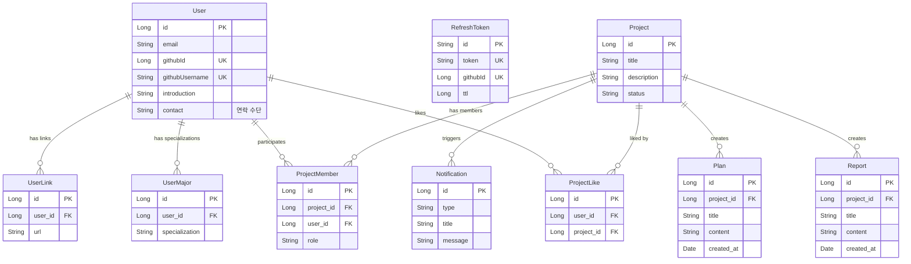

# Pmanchu_BE

```mermaid
erDiagram
    
    User {
        Long id PK
        String email
        Long githubId UK
        String githubUsername UK
        String introduction
        String contact "연락 수단"
    }

    UserMajor {
        Long id PK
        Long user_id FK
        String specialization
    }

    UserLink {
        Long id PK
        Long user_id FK
        String url
    }

    RefreshToken {
        String id PK
        String token UK
        Long githubId UK 
        Long ttl
    }

    ProjectLike {
        Long id PK
        Long user_id FK
        Long project_id FK
    }

    Project {
        Long id PK
        String title
        String description
        String status
    }

    ProjectMember {
        Long id PK
        Long project_id FK
        Long user_id FK
        String role
    }

    Notification {
        Long id PK
        String type
        String title
        String message
    }

    Report {
        Long id PK
        Long project_id FK
        String title
        String content
        Date created_at
    }

    Plan {
        Long id PK
        Long project_id FK
        String title
        String content
        Date created_at
    }

    User ||--o{ ProjectLike : "likes"
    User ||--o{ ProjectMember : "participates"
    User ||--o{ UserMajor : "has specializations"
    User ||--o{ UserLink : "has links"
    Project ||--o{ Report : "creates"
    Project ||--o{ Plan : "creates"
    Project ||--o{ ProjectLike : "liked by"
    Project ||--o{ ProjectMember : "has members"
    Project ||--o{ Notification : "triggers"
```